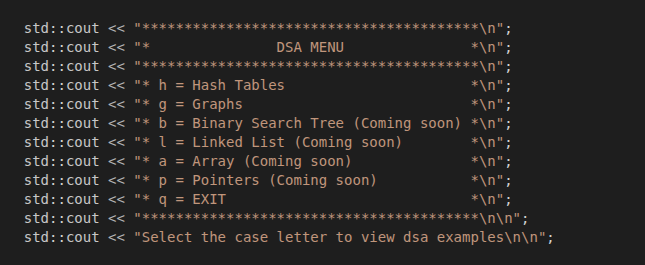
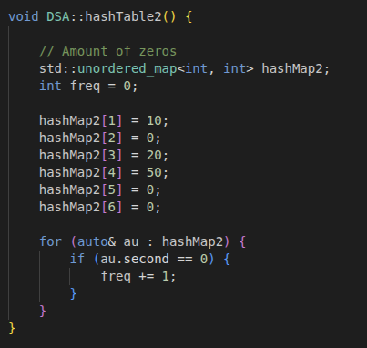

<h1> Data Structure and Algorithm Library </h1>

 

For this project, I am creating a DSA library with using C++. This can be a useful source for ohter programmers that wants to start learning data structure and algorithm using a low-level language like C++ and then practice online exercising problems.
  
The type of data structure that I have listed in this project are arrays, hash tables, linked list, binary search tree, and graphs. There will be more data structures comming soon while continuing to work on it.
  
<h2> The Menu: <h2>

<h2> Array: </h2>
Discussion coming soon...

<h2> Hash Tables: </h2>
There are six examples of hashtables (3 hashmaps and 3 hashsets).  
Hashmap examples:  
 
<h2> Binary Search Tree: </h2>
Discussion coming soon...

<h2> Linked List: </h2>
Discussion coming soon...

<h2> Graphs: </h2>
Discussion coming soon...

<h2> Pointers: </h2>
Discussion coming soon...
